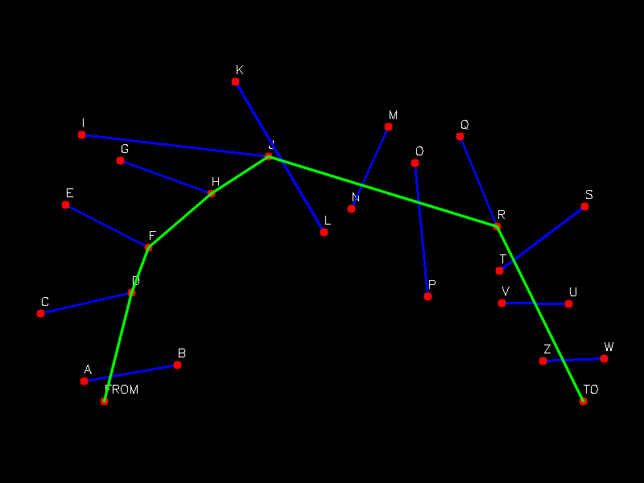
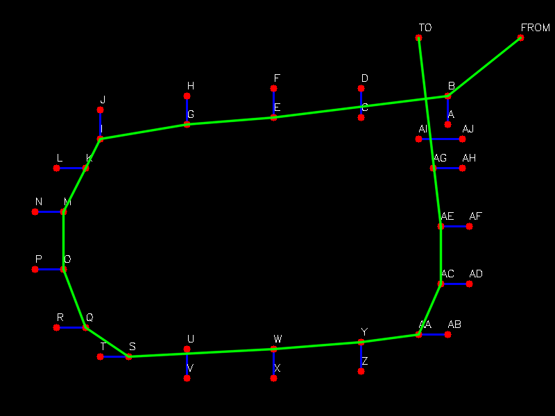

# FunnelPathFinder

A C++ implementation of the Funnel Algorithm for shortest-path finding through a sequence of gateways, with step-by-step visualization using OpenCV and GEOS.

## Features

- Reads 2D points from a JSON file (`data.json`)
- Groups points into "FROM", "TO", and gateway pairs
- Computes the shortest path using the funnel algorithm
- Visualizes each step of the algorithm and saves the process as a video
- Outputs the final path as an image and the full visualization as a video

## Demo




The full step-by-step visualization is available in the included video:

[▶️ funnel_visualization.avi](./funnel_visualization.avi)
[▶️ funnel_visualization2.avi](./funnel_visualization2.avi)

## Usage

### Build

```bash
mkdir build
cd build
cmake ..
make
```

### Run

```bash
./pathfinder
```

- Make sure `data.json` is in the parent directory or update the path in `main.cpp`.
- The program will generate:
  - `shortest_path_result.png` — the final path image
  - `funnel_visualization.avi` — the step-by-step video

## Dependencies

- OpenCV (for visualization and video)
- GEOS (for geometric orientation)
- nlohmann/json (for JSON parsing)git 

## Core Funnel Algorith Complexity

- Each portal (edge) is processed once.
- Each point in left and right is processed in amortized constant time (never revisited).
- Operations like geos_orientation and state manipulations are all O(1) per element.
- The total time complexity is O(n) — linear in the number of portal edges.